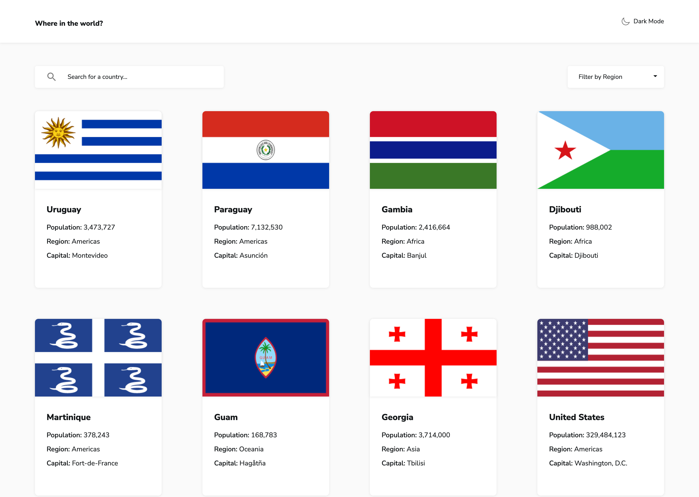
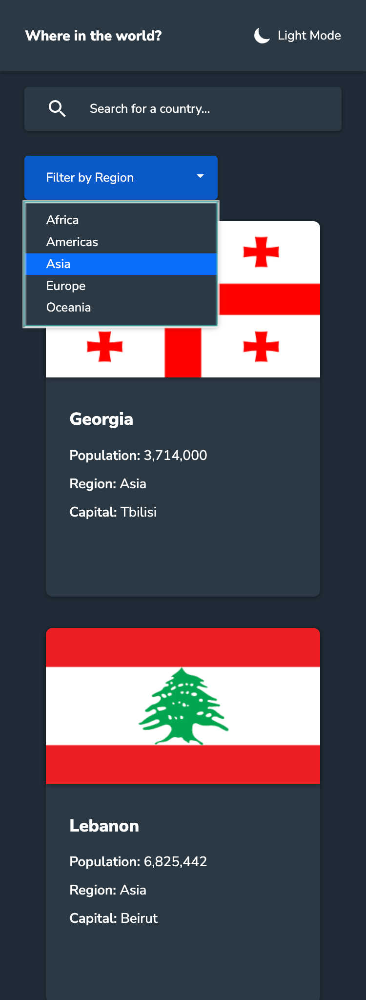

# REST Countries API with color theme switcher

  
  
  
  

## Overview

_Learn basic facts about the countries of the world._

<!--  -->

## Links

<a href="/.github/README.md">GitHub repo</a> • <a href="/.github/CONTRIBUTING.md">Live demo </a>

 

## How to run the project

1. `git clone HTTPS_REPO_URL MY-FOLDER-NAME`
2. `cd MY-FOLDER-NAME`
3. `npm install`
4. `npm start`
5. visit `http://localhost:3000`

 

## Features

- View a list of all countries of the world with basic facts about each.
- Filter countries based on region.
- Search for countries by their name.
- Click on a card to see more details about the country and navigate to bordering countries.
- Toggle dark/light mode.
- Responsive.
- Accessible.

  

## Technologies

- `React.js` to build the UI.
- `react-router-dom` for the navigation between views.
- `react-bootstrap` to build accessible components.
- `localStorage` to set the correct theme depending on system color scheme and user's choices
- `scss` to write the app's styling.
- `axios` to query the API.

 

## Description

This project is my submission for the REST Countries API with color theme switcher challenge from Frontend Mentor.

> ## The challenge
>
> Your challenge is to integrate with the REST Countries V2 API to pull country data and display it like in the designs.
>
> You can use any JavaScript framework/library on the front-end such as [React](https://reactjs.org) or [Vue](https://vuejs.org). You also have complete control over which packages you use to do things like make HTTP requests or style your project.
>
> Your users should be able to:
>
> - See all countries from the API on the homepage
> - Search for a country using an `input` field
> - Filter countries by region
> - Click on a country to see more detailed information on a separate page
> - Click through to the border countries on the detail page
> - Toggle the color scheme between light and dark mode _(optional)_

### How I built this project

#### Routing

First, I focused on setting up React Router v6 for the navigation: defining routes, dividing the app in components and passing them the props they need.

  

At this point the routing worked but the app still had a very basic appearance.

Once I could access all views of the app by navigating to them, I started working on their interactivity.

### Filtering and search functionalities.
    
I chose to keep the state of filters and the search term in the URL (mainly for practice). To avoid a duplicate content issue, I added the appropriate `<meta>` tag.

### Improving markup

Then I started working on HTML markup. I used `react-bootstrap` since it provides accessible components, especially the `Dropdown` component. Later, I refactored some of the components for better code legibility and to reduce accessibilites issues.

### Styling

I added styling using a mobile-first approach with `scss`. From the layout individual components.

### Backend

There is no backend code. The data is fetched from REST countries API. I created a `countriesService` module that I use in App.js to fetch the data.

### What I learned

My main goal for this project was to practice using React Router v6. It also helped me solidify my understanding of React.

 

### Recommended technologies and tools

- `prettier` for code formatting.

 

## Status

The app is working but needs improvements.

### Planned changes

- [x] Refactor the CSS to avoid unnecessary high specificity, reduce code where possible, customize Bootstrap's theme utility.
- [ ] Add state for loading.
- [ ] Add a retry functionality when fetching the API fails.

## Sources

- [REST Countries API with color theme switcher by Frontend Mentor.](https://www.frontendmentor.io/challenges/rest-countries-api-with-color-theme-switcher-5cacc469fec04111f7b848ca/hub/rest-countries-api-with-color-theme-switcher-5-55ZCQuW)

## Useful references

1. [URLSearchParams on MDN](https://developer.mozilla.org/en-US/docs/Web/API/URLSearchParams)

## Author

- [@AngeliqueDF on GitHub.](https://github.com/AngeliqueDF)
- [Visit my website.](https://adf.dev)
- [View my Frontend Mentor profile.](https://www.frontendmentor.io/profile/AngeliqueDF)
